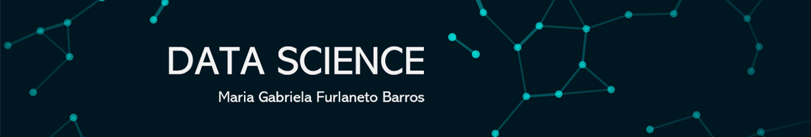

  

# Maria Gabriela Furlaneto Barros 
*Enfermeira Assistencial * Hospital Nove de Julho - São Paulo - Aspirante em Ciencias de Dados. 

Enfermeira formada pela Faculdade de Medicina de Marília (2013 - 2016), Pós Graduada pelo formato Residencia pelo Programa Uniprofissional de Clínico - Cirúrgica Hospital Sírio Libanes.  Ex Bolsista do Programa de Intercãmbio cultural do Centro Paula Souza (out/2011) e da Bolsa Santander (out/2015) para aperfeiçoamento na áera hospitalar. Nível Avançado de Inglês, Intermediário em Espanhol e Básico em Francês. Habilitação Técnica em Informática. Atualmente, atuando na Clínica Médica e Aspirante em Ciências de Dados. Tenho como principal objetivo aprender Data Science para aplicá - la na saúde.  

Neste portfólio você encontrará um repositório dos projetos e estudos contruidos a partir do curso "Data Science na Prática" do Sigmoidal. 

**Background in:** Enfemagem, Transformação Digital, Data Science.

**Links:**

* [LinkedIn](https://www.linkedin.com/in/maria-gabriela-furlaneto-barros-410194150/)
* [Currículo Lattes](https://bit.ly/2MFTAF7)

## Projetos:
1. **Analisando dados da Airbnb - Rio de Janeiro**: (https://bit.ly/3h5SQXK)
2. **Analisando a violencia no Rio de Janeiro ** : ()

---
